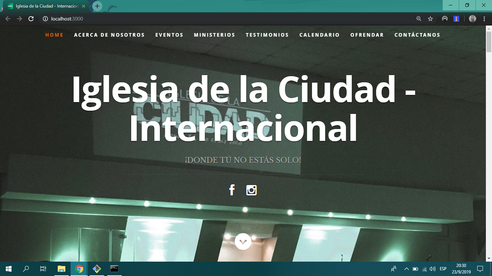

# Iglesia_UX
Proyecto de la clase Experiencia de Usuario para la Iglesia de la Ciudad

Enlace github page: https://ralc365.github.io/Iglesia_UX/
Enlace repositorio: https://github.com/RALC365/Iglesia_UX

Backend: servicio de datos: 3% ✅ Done

Backend: procesamiento en el lado del server (por ej. con functions): 3% ✅ Done

Autenticación y autorización: 3% ✅ Done

Envío de notificaciones: 3% ✅ Done

Despliegue público de la aplicación: 3% ✅ Done

Repositorio de github con evidencia del trabajo realizado: 2% ✅ Done

Look and feel: 3% ✅ Done

Funcionalidad general de la aplicación: 5% ✅ Done

Se utilizó el framework React junto con Firebase (Hosting, Storage, Function, Autentification).
Se utiliza las base de dato en Real Time para objetos dinámicos, como ser eventos, notificaciones, mensaje... Y Cloud Firestore para objetos estáticos, por ejemplo, About Us.

Cabe mencionar, que este proyecto se continuará trabajando (puliendo) para su futura lanzamiento como página web de la Iglesia de la Ciudad.

--------------------------SCREENSHOTS--------------------------

Home

Acerca de nosotros

Eventos

Ministerios

Testimonios/Frases

Calendario - Mes

Calendario - Agenda

Ofrendar - Llenando formulario

Ofrendar - Transacción procesada

Contáctanos 

DEMO

